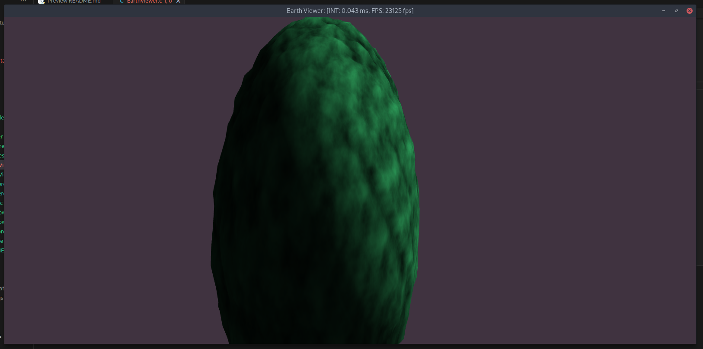

# Earth -- C Implementation

This contains the C implementation of the Earth program written entirely in C. To edit and run this project, I would suggest that Make be used to compile the program.

This program relys on GLFW and GLEW.