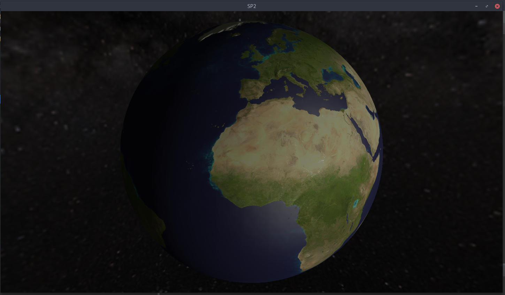

# Earth -- Java Implementation

This contains the java implementation of the Earth program written entirely in Java. To edit and run this project, I would suggest that Eclipse be used as seeing that this is what was used to develope the program.
This program relys on LWJGL 3 Libraries contained within the [lib folder](./lib).